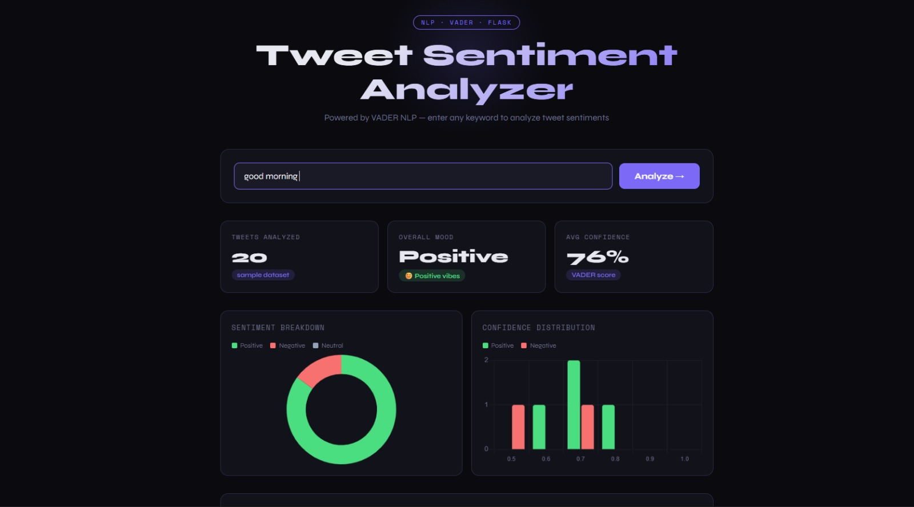
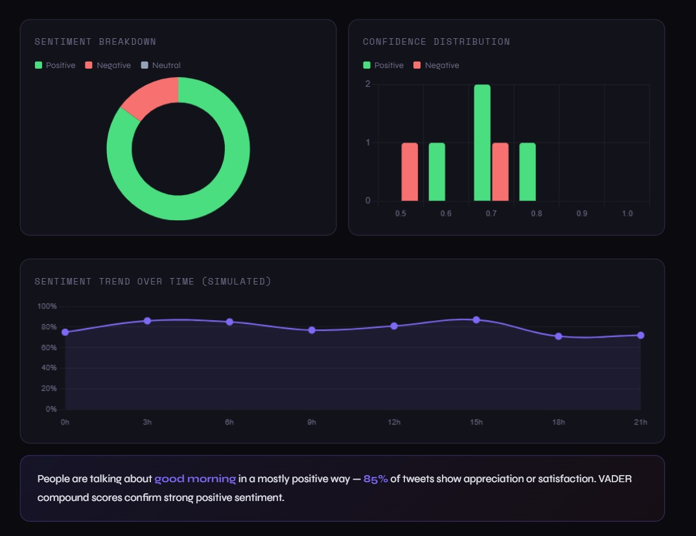

# 🐦 Tweet Sentiment Analyzer

A web-based NLP project that analyzes the sentiment of tweets for any keyword using **VADER** (Valence Aware Dictionary and sEntiment Reasoner) — a rule-based sentiment analysis tool specifically designed for social media text.

Built as a resume project for B.Tech CSE (Data Science) at **Bennett University**.

---

## 🚀 Live Demo

👉 **[Click here to view the live project](https://tweet-sentiment-analyzer-42n9.onrender.com)**

> Note: First load may take 30-50 seconds (free server waking up)

---

## 📸 Screenshots

### Home Page


### Analysis Results


---

## ✨ Features

- 🔍 Enter any keyword — get instant sentiment analysis
- 🤖 Real NLP using **VADER** (not just word counting)
- 📊 3 interactive charts: Donut, Bar & Line (trend)
- 🧠 Plain-English explanation of results
- 🐍 Python + Flask backend
- 💻 Clean dark-themed UI

---

## 🛠️ Tech Stack

| Layer | Technology |
|---|---|
| Backend | Python 3, Flask |
| NLP | VADER (vaderSentiment) |
| Frontend | HTML, CSS, JavaScript |
| Charts | Chart.js |
| Fonts | Google Fonts (Syne, Space Mono) |
| Deployment | Render (Gunicorn) |

---

## 📁 Project Structure

```
tweet-sentiment-analyzer/
│
├── app.py                              ← Flask backend + VADER logic
├── requirements.txt                    ← Python dependencies
├── run.bat                             ← Double-click to launch (Windows)
├── install.bat                         ← Install dependencies (run once)
├── sentiment_analysis_notebook.ipynb   ← Step-by-step Jupyter notebook
├── README.md
│
└── templates/
    └── index.html                      ← Frontend UI
```

---

## ⚙️ How to Run Locally (Windows)

### Step 1 — Install dependencies (only once)
Double click → `install.bat`

### Step 2 — Run the web app
Double click → `run.bat`
> Browser opens automatically at http://localhost:5000

### Step 3 — View Jupyter Notebook
Open project folder → click address bar → type `cmd` → Enter
```bash
python -m notebook sentiment_analysis_notebook.ipynb
```

---

## 🧠 How It Works

### What is VADER?
VADER is a lexicon and rule-based sentiment analysis tool built for social media. It returns 4 scores:

| Score | Meaning |
|---|---|
| `pos` | Proportion of positive sentiment |
| `neg` | Proportion of negative sentiment |
| `neu` | Proportion of neutral sentiment |
| `compound` | Overall score from -1.0 to +1.0 |

### Classification Logic
```python
if compound >= 0.05:   → Positive
if compound <= -0.05:  → Negative
else:                  → Neutral
```

### Architecture
```
User enters keyword
      ↓
Flask generates simulated tweets
      ↓
VADER analyzes each tweet → compound score
      ↓
Tweets classified as Positive / Negative / Neutral
      ↓
Results sent to frontend as JSON
      ↓
Chart.js renders 3 interactive charts
      ↓
Plain-English summary shown to user
```

---

## 👤 Author

**Vasu Singhal**
B.Tech CSE (Data Science) — Bennett University

[](https://www.linkedin.com/in/vasu-singhal-46659a310)
[](https://github.com/Vasu-singhal01)

---

## 📄 License

MIT License — free to use and modify.
